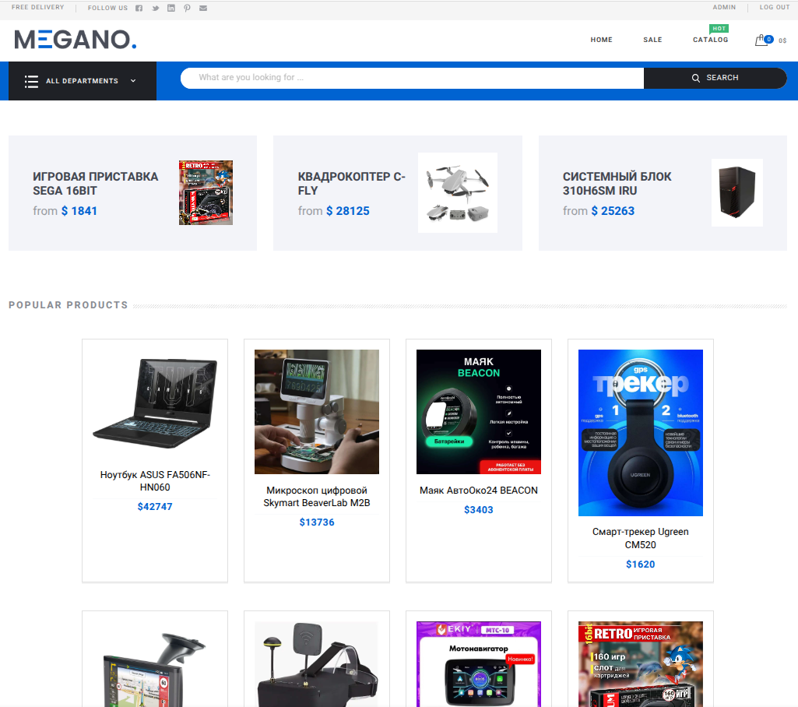
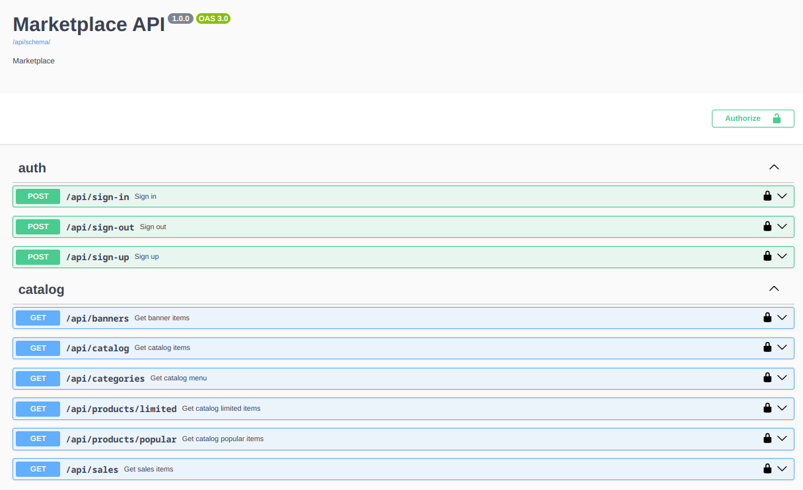

# Приложение Marketplace

## Что из себя представляет проект
Это backend django-приложение, которое осуществляет взаимодействие с frontend.
Берет на себя все, что связано с получением данных от frontend, реализацией бизнес логики и возвращением данных по API.



## Контракт для API
Названия эндпоинтов и ожидаемую структуру ответа от API можно найти в [README/Marketplace API.yaml](./README/Marketplace API.yaml).




## Обязательная конфигурация для развертывания и запуска приложения

### 1. Установка Docker
#### Запуск приложения преимущественно осуществляется в Docker контейнере.
<details>
<summary>Если Docker не установлен...</summary>

Установить Docker можно вручную, следуя инструкциям с [официального сайта](https://docs.docker.com/engine/install/), или автоматически с помощью следующей команды:
```
curl -sSL https://get.docker.com | sh
```
</details>


### 2. Клонируем git репозиторий

<details>
<summary>Если git не установлен...</summary>

```
apt-get install git &&
git config --global user.name "John Doe" &&
git config --global user.email johndoe@example.com
```
</details>

```
git clone https://gitlab.skillbox.ru/alexey_suslov/python_django_diploma.git
```
Переходим в директорию проекта. 
```
cd python_django_diploma
```
Создаем виртуальное окружение и активируем его.
```
python3 -m venv .venv &&
source .venv/bin/activate
```

### 3. Настраиваем переменные окружения
#### 3.1. Для запуска приложения локально
Необходимо переименовать файл ".env.dev.example" в ".env.dev" и заполнить его актуальными данными.
```
mv .env.dev.example .env.dev
```

#### 3.2. Для запуска приложения в docker контейнере
Необходимо переименовать файл ".env.prod.example" в ".env.prod" и заполнить его актуальными данными.
```
mv .env.prod.example .env.prod
```

#### 3.3. Возможные значения переменных окружения (только в контексте данного проекта !!!)
<details>
<summary>Осторожно - лонгрид</summary>

###### DJANGO_SECRET_KEY: ключ - на свой выбор
> DJANGO_SECRET_KEY=super-secret-key

###### DJANGO_ALLOWED_HOSTS: адреса разрешенных хостов
> Для запуска приложения локально 
>> DJANGO_ALLOWED_HOSTS="127.0.0.1, localhost"
> 
> Для запуска приложения в docker контейнере 
>> DJANGO_ALLOWED_HOSTS="0.0.0.0"

###### DJANGO_DEBUG: режим отладки 
> Для включения режима отладки (НЕ ИСПОЛЬЗОВАТЬ В PRODUCTION: в этом режиме будет работать debug-toolbar)
>> DJANGO_DEBUG=1
> 
> Для отключения режима отладки
>> DJANGO_DEBUG=0

###### DB_ENGINE: используемый движок базы данных
> Для использования базы данных Postgresql
>> DB_ENGINE=postgresql
> 
> Для использования базы данных Sqlite
>> DB_ENGINE=sqlite

###### DB_NAME: имя базы данных
> DB_NAME=postgres

###### DB_USER: имя пользователя
> DB_USER=postgres

###### DB_PASSWORD: пароль пользователя
> DB_PASSWORD=postgres

###### DB_HOST: адрес базы данных
> Для запуска приложения локально
>> DB_HOST=0.0.0.0
> 
> Для запуска приложения в контейнере
>> DB_HOST=postgres

###### DB_PORT: порт базы данных
> Для запуска приложения локально
>> DB_PORT=5002
> 
> Для запуска приложения в контейнере
>> DB_PORT=5432

</details>

### 4. Подготовка базы данных
Запускаем контейнер с базой данных Postgres
```
docker compose up -d postgres
```
Далее переходим в каталог приложения и применяем миграции:
```
cd ./marketplace &&
python manage.py migrate
```
Затем импортируем данные из фикстуры:
```
python manage.py loaddata fixtures/db_data_fixture.json
```

### 5. Запуск приложения
#### 5.1. Запуск приложения локально
```
python manage.py runserver
```
Приложение доступно по адресу: [http://localhost:8000](http://localhost:8000)  
Админка магазина: [http://localhost:8000/admin](http://localhost:8000/admin)  
login: admin, password: 123

#### 5.2. Запуск приложения в контейнере 
```
docker compose up -d
```
Приложение доступно по адресу: [http://0.0.0.0](http://0.0.0.0)


